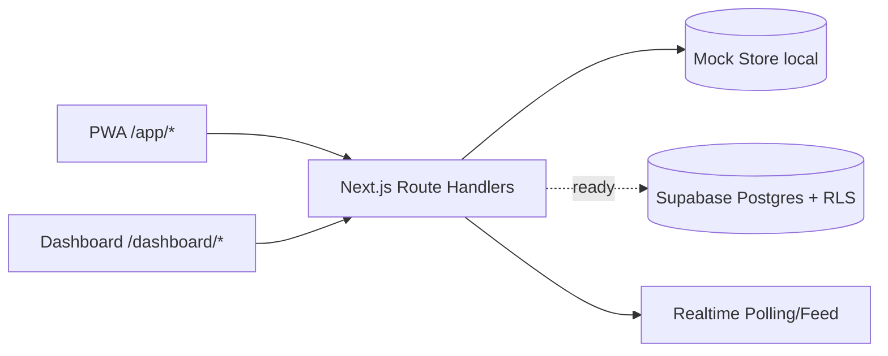

# ARCHITECTURE — VendaForça MVP

## Decisões técnicas
- Monorepo com workspaces para compartilhar tipos/utilitários.
- MVP com mock in-memory para rodar local de forma imediata.
- Migrações Supabase + RLS já prontas para swap do mock por banco real.
- Next.js App Router com rotas separadas `/app/*` (mobile) e `/dashboard/*` (desktop).
- Segurança por camadas: validação Zod, sanitização DOMPurify, middleware por role, headers fortes, rate limit.

## TODO(owner)
- Stripe billing e portal.
- Provedor de e-mail.
- Push notifications com VAPID.
- NF-e/ERP.
- White-label por subdomínio.
